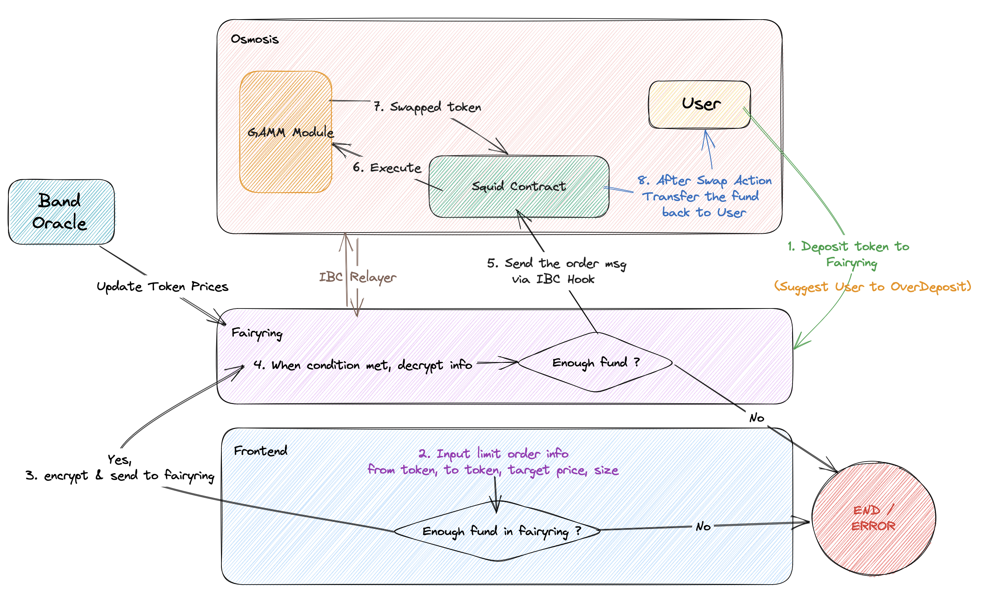

# Threshold Encrypted Stop Loss Orders

This document describes how to enable threshold encrypted stop loss orders on Osmosis using Fairblock.

## Motivation

Existing protocols like 1inch or 0x that support limit orders/stop orders are all in the clear.
Generally, this is not advisable as searchers/adversaries are able to see key levels of a particular trading pair and possibly manipulate the market to trigger your order.
By encrypting the contents of a limit order, this market manipulation is prevented.

## Design

We give a simple example for what the desired user flow should look like.

User has 500OSMO. The current price (TWAP oracle) is 0.5USDC/OSMO. 
The user places a limit sell for 500OSMO with a trigger price of 0.4USDC/OSMO.
When the current price (TWAP oracle) `<= 0.4`, the user's stop loss is triggered, and ends with ~200USDC (definitely less due to fees, slippage, etc).

Using Fairblock's `conditionalenc` module, the functionality to arbitrarily encrypt any Osmosis message/transaction using any ID is possible without requiring the module to be installed on Osmosis. 

For stop loss orders, we encrypt using a combination of the TWAP (at fix-width ticks) and a global nonce. 

We use the global nonce as a way to keep track of how many times a particular price tick has been hit.
This is because once a particular nonce has been used, the decryption key will already be released and future orders would already be able to be decrypted.

### Encryption of User Orders

We use an encrypted version of swap functions available in the 0xsquid contract to faciliate the stop loss. 
Using the above example, the current TWAP is 0.5USDC/OSMO. 
We encrypt the swap message using the ID `(0.4USDC/OSMO, 0)` 
assuming the current global nonce for all ticks is 0, tick size of 0.05, and a reasonable `TokenOutMinAmount` value. 
Then we submit the encrypted payload in a `MsgSubmitEncryptedTx` message.

Suppose the following block, the TWAP becomes 0.35USDC/OSMO. Then, the following execution flow occurs:

1. Decryption key request is sent for `(trigger, nonce) = (0.5USDC/OSMO, 0), (0.45USDC/OSMO, 0), (0.4USDC/OSMO, 0), (0.35USDC/OSMO, 0)`. 
2. Increment global nonce for the affected ticks: `(trigger, new_nonce) = (0.5USDC/OSMO, 1), (0.45USDC/OSMO, 1), ...`.
3. For every encrypted limit order in store: 
    - attempt to decrypt the transaction using all released keys
    - relay the transaction to the 0xsquid contract on Osmosis chain

### Execution Details

We provide some additional details on how execution might occur for these types of orders.
In order to execute the swap messages on Osmosis chain, we require an ibc relayer between Fairyring and Osmosis chains. The validity of the decrypted swap messages is not verified on Fairyring so it is important to ensure the correctness of the swap message in advance to prevent fund losses.

To address the issue of spam on the network, one can perhaps make this service available to only OSMO stakers. 
Another alternative is to have a fixed fee for submitting an order for the network.
Finally, one can add an expiry mechanism so that old orders are flushed and removed from state (maybe the fixed fee is a function of time in force).

## Architecture Diagram



---

## Other Notes (Don't publish)

There are a lot of uncertainty around execution. 
For example, if there are many stop loss orders at a particular tick, users may incur a high slippage. 
We want to guarantee execution, however this would also depend on the slippage limits a user sets. 
Setting `TokenOutMinAmount` as the minimum possible value would potentially drain a pool.
Perhaps batching the stop loss orders at each tick, executing the swap, and then running `protorev` might result in better price execution.

Another detail is on the quantity of these orders. An attacker may be able to flood the chain with dummy orders and slow down decryption. 
Perhaps an expiry mechanism can be added, so that really old orders are flushed and removed from the state.
Alternatively, some sort of collateral/fee can be used to address spam issue.

### Osmosis Swap Test

In order to test the swap functionality using the squid contract on Osmosis chain, follow the below steps:

1. Clone the osmosis chain repository in the same directory where the fairyring direcotry is located.

```bash
git clone git@github.com:osmosis-labs/osmosis.git
```

2. Setup and run the Fairyring chain using the provided script in `fairyring/testutil/swap-test/start-fairy.sh`.
When running this script, it asks for a number `i` to set the chain id as `fairytest-i`.

3. Setup and run a local version of Osmosis chain using the provided script in `fairyring/testutil/swap-test/start-osmo.sh`.

4. Start the IBC relayer using the provided script in `fairyring/testutil/swap-test/relayer.sh`.
Input the same value for `i` as in step 2.

5. Perform a swap from `frt` to `uosmo` using the provided script in `fairyring/testutil/swap-test/test-swap.sh`.
This script will send some `frt` to the Osmosis chain to be able to create a pool. Then deploys the squid contract and creates the pool.
Finally, it will send a swap packet to the contract and after receiving the output `uosmo` in the format of an ibc transferred token, it will query and show the balance of the user on Fairyring chain which now includes the new swapped token.
